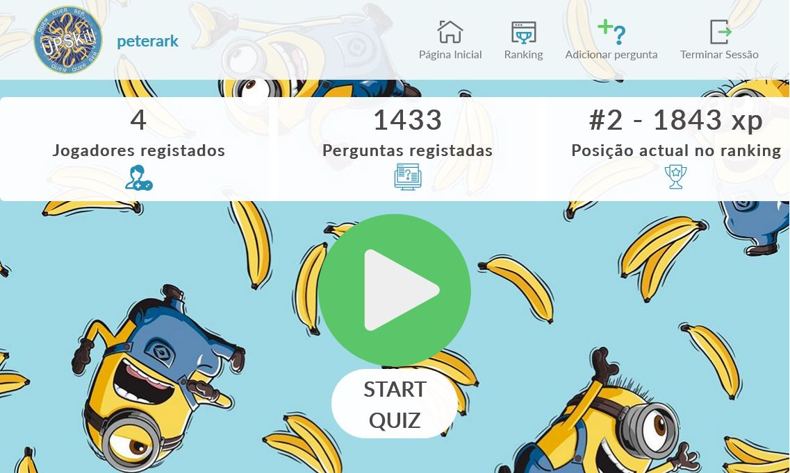

# B2-Desafio-Final

## 1 Introdução

Plataforma para um jogo online: Quem Quer Ser Upskill? A plataforma pretende avaliar o nível de conhecimento dos
jogadores nas mais diferentes áreas de conhecimento. O resultado obtido pelos participantes é apresentado num ranking de
pontos.

## 2 Requisitos do Desafio

### 2.1 Autenticação

Os utilizadores conseguem registar-se na plataforma, indicando o primeiro e último nome, email, localidade e
palavra-passe. A autenticação na plataforma é feita através do username e palavra-passe.

A plataforma não permite a entrada de utilizadores não autenticados em certas páginas,
nomeadamente ao jogo concreto. A palavra-passe armazenada na base de dados é encriptada.

### 2.2 Dashboard

O dashboard é a página que um utilizador vê após efetuar a autenticação. Nesta página deve é possível ver algumas
estatísticas da plataforma:

* Número de jogadores registados.
* Número de perguntas armazenadas
* Ranking dos jogadores
* Top pontuação do próprio jogador

### 2.3 Perguntas

Após o utilizador clicar no botão "Jogar", este iniciariá o jogo composto por 15 perguntas. As perguntas armazenadas
na base de dados estão catalogadas com as dificuldades de Fácil (1), Média (2), Difícil (3), Impossível (4). Cada
pergunta contém 4 hipóteses de resposta, havendo apenas uma correta. A distribuição das perguntas ao longo do jogo é
feita da seguinte forma:

* 1 a 4: Perguntas fáceis (1)
* 5 a 9: Perguntas médias (2)
* 10 a 14: Perguntas difíceis (3)
* 15: Pergunta impossível (4)

O tempo para responder a cada pergunta também varia consoante a sua dificuldade:

* Fáceis: 20 segundos
* Médias: 30 segundos
* Difíceis: 40 segundos
* Impossíveis: 60 segundos

A atribuição dos pontos varia consoante a dificuldade da pergunta respondida e o tempo que sobra, correspondendo a 1
ponto por cada segundo.

* Fáceis: 50 pontos
* Médias: 75 pontos
* Difíceis: 100 pontos
* Impossíveis: 200 pontos

Uma resposta incorreta implica o término do jogo, sendo atribuída uma cotação de 0 pontos à resposta em causa. Caso o
tempo de resposta tenha terminado sem resposta do utilizador.

### 2.4 Criação de Perguntas

Um utilizador pode submeter novas perguntas. Para tal, deve indicar o texto da pergunta, as quatro hipóteses de resposta
e a resposta correta.

## 3 Extras

É dada ao utilizador a possibilidade de utilizar ajudas. O utilizador só pode utilizar um tipo de ajuda por jogo. Pode
utilizar as ajudas todas na mesma pergunta.

### 3.1 Ajuda do Público

Consiste na resposta de elementos do público à resposta em causa. Consoante a dificuldade da pergunta, a precisão de
resposta varia. No caso de uma pergunta fácil, o público tem 70% de precisão, o que significa que 70% dos membros do
público irão responder à resposta correta e os restantes 30% darão respostas aleatórias. As probabilidades são as
seguintes:

* Fáceis: 70%
* Médias: 50%
* Difíceis: 30%
* Impossíveis: 20%

### 3.2 Ajuda do 50/50

Consiste na eliminação de duas opções erradas, restando apenas uma hipótese correta e outra errada.

### 3.3 Troca de pergunta

Consiste na troca da pergunta por outra de igual dificuldade.

## 4 Base de dados e API

Foi desenvolvida e implementada uma base de dados capaz de gerir os acessos ao jogo, registo de utilizadores,
registo de rankings. A base de dados foi implementada em MySQL.

As perguntas estão armazenadas numa base de dados externa, acessível apenas via API.

Para a criação de uma nova pergunta, é feito um pedido HTTP POST contendo a pergunta em si, as quatro hipóteses e a
opção correta.

Através de um pedido HTTP GET é possível obter perguntas para o correto funcionamento do jogo. As perguntas vêm agrupadas consoante a
dificuldade pedida.

O modo de funcionamento da API encontra-se mais detalhado em:
https://serro.pt/perguntas/api

Realizado por:

+ Carla Alexandra Nogueira

+ João Figueiredo

+ Marco Humberto Americo Manuel

+ Pedro Miguel Duarte André

+ Rodrigo de Sa Ramos Esteves

+ Tiago Costa

